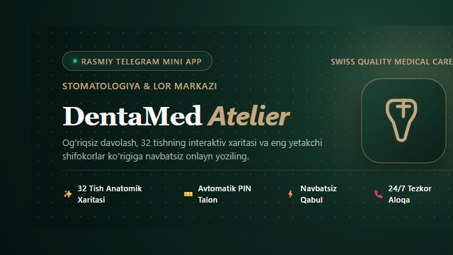

# 🏥 DentaMed Atelier — Stomatologiya & LOR Klinikasi Ekotizimi

<p align="center">
  
</p>

<p align="center">
  <a href="https://t.me/DentaMedKlinika_bot"></a>
  
  
  
  
  
</p>

---

## 🌟 Loyiha Haqida

**DentaMed Atelier** — zamonaviy xususiy stomatologiya va LOR klinikalari uchun mo'ljallangan to'liq raqamli ekotizim (Telegram Mini App + CRM Backend). 

Bemorlar ortiqcha mobil ilova yuklab o'tirmasdan, to'g'ridan-to'g'ri Telegram ichida klinika xizmatlari bilan tanishadi, **32 ta tishning anatomik xaritasidan** og'riyotgan tishini tanlaydi, bo'sh vaqt slotlariga navbatsiz onlayn yoziladi va shaxsiy **PIN-kodli Qabul Taloniga** ega bo'ladi.

---

## 🚀 Asosiy Imkoniyatlar (Key Features)

### 1. 🦷 32-Tishlik Interaktiv Anatomik Yoy Modeli
- Xalqaro **FDI (Federation Dentaire Internationale)** stomatologik belgilash tizimi (№11 — №48).
- Har bir tish uchun 6 xil klinik holat: *Sog'lom*, *Karies*, *Plomba*, *Toj (Koronka)*, *Implant*, *Olingan*.
- **Ko'zgu (Mirror)** va **Shifokor nigohi (FDI Clinical)** ko'rinishlarini 1 ta tugma bilan almashtirish.
- Tish tanlanganda avtomatik diagnostika, tavsiya etiladigan muolaja va narxning ekranda ochilishi.

### 2. 📱 Telegram Mini App & Native Integratsiya
- Telegram WebApp SDK bilan 100% moslashgan.
- **Telegram Haptic Feedback:** Tishlar, tugmalar bosilganda telefonning mayin titrashi (Light, Medium, Success, Warning).
- **Native Dialoglar:** Brauzerning oq alertlari o'rniga rasmiy `Telegram.WebApp.showConfirm` va `Telegram.WebApp.showAlert` oynalari.
- Bemor ro'yxatdan o'tishi bilan uning shaxsiy Telegramiga chipta va talon ma'lumotlari avtomatik yetkaziladi.

### 3. ⚡ FastAPI + Python Backend & Bot API
- Asinxron FastAPI REST API (`/api/appointments`, `/api/doctors`, `/api/services`).
- Buyurtma tushgan zahoti:
  1. Bemorning Telegramiga chiroyli HTML formatidagi qabul taloni yuboriladi.
  2. Klinika ma'muriyat guruhiga yangi bemor haqida xabarnoma boradi.
- Ma'lumotlar JSON bazada (`backend/data/`) saqlanadi — mustaqil va yengil.

### 4. 🎨 Design Engineering Suite (Taste & Vercel Standartlari)
- Sun'iy intellektning arzon "vibe-coder" ko'rinishidan holi, elita tibbiy hashamat palitrasi: **Chuqur Zumrad Yashil (`#112E24`)**, **Shampan Tillasi (`#C5A880`)** va **Fil Suyagi (`#FAF8F5`)**.
- To'liq sozlangan **Kun / Tun (Dark / Light)** rejimi.
- Apple va Linear standartidagi teginish fizikasi (`active:scale-[0.98] transition-transform`).
- Mobil barmoq o'lchamlari (kamida 44x44px) va `tabular-nums` raqamlar barqarorligi.

### 5. 🔄 Dinamik Narxlar va Shifokorlar Boshqaruvi
- Shifokorlar va xizmat narxlari frontend kodiga qotirilmagan (hardcoding yo'q).
- Klinika xizmat narxini o'zgartirsa yoki yangi shifokor ishga olsa, serverdagi JSON orqali frontendni qayta yig'masdan (build'siz) darhol barcha foydalanuvchilarda yangilanadi.

### 6. 👂 LOR ↔ Stomatologiya Kross-Marketingi
- Gaymorit va tish og'riqlari bir-biriga bevosita bog'liq ekanligi bo'yicha kross-aksiya.
- Stomatologiyada davolangan bemorga LOR ko'rigi uchun rag'batlantiruvchi chegirma berilib, bitta bemordan olinadigan daromad 2 barobar oshiriladi.

---

## 📂 Loyiha Tuzilishi (Project Structure)

```text
dental_lor_med/
├── .agents/
│   └── skills/                # 5 ta elita frontend dizayn ko'nikmalari
│       ├── taste-skill/
│       ├── web-design-guidelines/
│       ├── avocode-design-system/
│       ├── image-to-code/
│       └── playwright-testing/
├── backend/
│   ├── data/
│   │   ├── appointments.json  # Qabullar bazasi
│   │   ├── doctors.json       # Shifokorlar ma'lumotlari
│   │   └── services.json      # Xizmatlar va narxlar
│   ├── bot.py                 # Telegram Bot (@DentaMedKlinika_bot)
│   ├── server.py              # FastAPI REST API server
│   └── .env.example           # Konfiguratsiya namunasi
├── docs/
│   ├── Prezentatsiya_Klinika_Rahbariga.html  # Xo'jayin uchun tayyor taqdimot
│   ├── Uchrashuv_va_Namoyish_Qollanmasi.md   # Uchrashuvda gapirish ssenariysi
│   └── schema.sql             # SQL ma'lumotlar bazasi sxemasi
├── frontend/
│   ├── src/
│   │   ├── components/
│   │   │   ├── InteractiveJawModel.tsx  # 32 tishlik anatomik yoy modeli
│   │   │   ├── DentalChart.tsx          # Tish diagnostika xaritasi
│   │   │   ├── ServiceTabs.tsx          # Xizmatlar va narxlar
│   │   │   ├── DoctorCard.tsx           # Shifokorlar profili
│   │   │   ├── BookingModal.tsx         # 3 bosqichli onlayn yozilish
│   │   │   ├── MyAppointments.tsx       # Bemor qabullari tarixi
│   │   │   ├── BeforeAfterGallery.tsx   # Oldin/Keyin natijalar slayderi
│   │   │   ├── Header.tsx               # Til (UZ/RU) va Kun/Tun rejimi
│   │   │   └── LuxuryIcons.tsx          # Vektor tibbiy piktogrammalar
│   │   ├── services/
│   │   │   └── api.ts                   # Dinamik backend API ga ulanish
│   │   ├── utils/
│   │   │   └── telegramAlerts.ts        # Telegram WebApp native dialoglari
│   │   └── App.tsx                      # Asosiy ilova boshqaruvi
│   ├── tailwind.config.js
│   └── vite.config.ts
├── dentamed_welcome_640x360.png         # BotFather uchun rasmiy 640x360 rasm
├── start_system.bat                     # Tizimni bitta tugma bilan yoqish skripti
└── README.md                            # Loyiha hujjatnomasi
```

---

## 🛠 O'rnatish va Ishga Tushirish (Quickstart)

### 1. Repozitoriyni klonlash:
```bash
git clone https://github.com/salomh46-rgb/DentaMedKlinika_bot.git
cd DentaMedKlinika_bot
```

### 2. Backend (FastAPI & Telegram Bot) sozlash:
```bash
# Python kutubxonalarini o'rnatish
pip install fastapi uvicorn httpx python-dotenv aiogram

# Backendni ishga tushirish (Port 8000)
python backend/server.py

# Telegram botni ishga tushirish
python backend/bot.py
```

### 3. Frontend (React + Vite) sozlash:
```bash
cd frontend
npm install
npm run dev
```
Brauzerda: `http://localhost:5173` ochiladi.

---

## 💼 Tijoriy Sotish Strategiyasi (Business Model)

Klinika egalari va bosh shifokorlariga taklif etish modellari:

| Model | Narxi | Kimlar uchun? | Tavsif |
| :--- | :--- | :--- | :--- |
| **Bir martalik («Pod Klyuch»)** | **$1,500 — $2,500** | Xususiy o'rtacha va yirik klinikalar | Klinika brendi, logotipi, shifokorlari va narxlarini to'liq moslab, mustaqil serverga o'rnatib topshirish. |
| **Oylik Obuna (SaaS)** | **$300 boshlang'ich + $60—$80/oy** | Kichik va o'rta klinikalar | Klinika uchun yengil boshlash, doimiy texnik qo'llab-quvvatlash va dasturchi uchun barqaror oylik passiv daromad. |

### 📊 ROI (Klinika uchun qaytim):
O'rtacha klinikada oyiga **20-30% bemorlar** qabulga yozilib, unutib kelmay qoladi. Ushbu tizim avtomatik eslatmalar orqali o'sha bemorlarni saqlab qolib, klinikaga **oyiga 15-25 mln so'm qo'shimcha daromad** keltiradi va o'z xarajatini 1-oydayoq to'liq oqlaydi.

---

## 👨‍💻 Muallif va Rivojlantiruvchi

* **Dasturchi:** Javohirbek Asqarov (Jasper)
* **Yo'nalish:** Senior Full-Stack Engineer & AI Systems Architect
* **Telegram:** [@DentaMedKlinika_bot](https://t.me/DentaMedKlinika_bot)
* **GitHub:** [salomh46-rgb](https://github.com/salomh46-rgb)

---

<p align="center">
  <i>DentaMed Atelier — Shveytsariya Standartidagi Tibbiy Aniqlik va Hashamatli Dizayn.</i>
</p>
